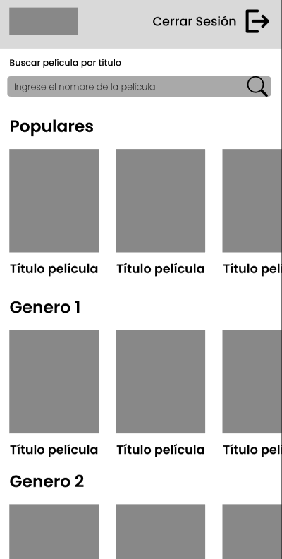
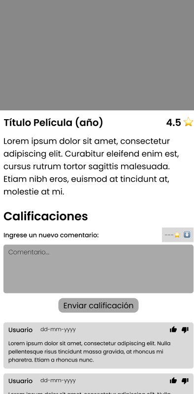
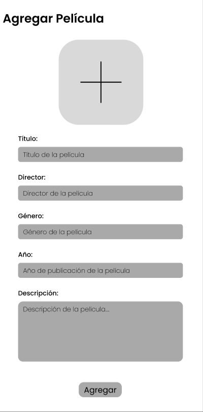

# Proyecto de móviles

## Integrantes del grupo:

- Rommel David Merchán Manzanillas
- Slayther Joshua Zamora Rodríguez

## Business challenge

El desafío reside en forjar una experiencia de usuario integral que faculte a los usuarios para compartir calificaciones y reseñas, enriqueciendo así la comunidad y ofreciendo una referencia confiable sobre la calidad del contenido. Además, se busca permitir a los usuarios evaluar la aceptación de sus reseñas mediante la interacción de la comunidad a través de likes y dislikes. La clave para el éxito radica en lograr una integración fluida de estas funcionalidades, impulsando la interacción y participación del usuario, con el fin de construir una plataforma de reseñas y comentarios que sea no solo enriquecedora, sino también altamente personalizada.

## Historias de usuario

### HU01: Calificaciones y Reseñas

#### Descripción

Yo, como amante del cine, quiero dar mi calificación y escribir reseñas sobre películas para que otros usuarios tengan una referencia sobre la calidad del contenido.

#### Criterios de Aceptación

##### Escenario: Calificar y Escribir una Reseña para una Película

- **Dado** que estoy en la página de detalles de una película
- **Cuando** escribo mi reseña y califico la película de 1 a 5 estrellas
- **Y** presiono el botón de enviar calificación
- **Entonces** mi reseña y calificación deberían quedar registradas en el sistema

##### Escenario: Modificar o Eliminar mi Calificación y Reseña

- **Dado** que he calificado y escrito una reseña para una película previamente
- **Cuando** vuelvo a la página de detalles de esa película
- **Entonces** debería ver mi calificación y reseña previamente ingresadas
- **Y** debería tener la opción de modificar mi calificación y reseña
- **O** debería tener la opción de eliminar completamente mi calificación y reseña

##### Escenario: Ver calificación y reseña de una película

- **Dado** que estoy en la página de detalles de una película
- **Cuando** miro la sección de calificaciones y reseñas
- **Entonces** debería ver la calificación promedio de la película
- **Y** debería ver las calificaciones y reseñas de otros usuarios, incluyendo sus nombres y fechas

##### Escenario: Interacción Social

- **Dado** que quiero interactuar con otros usuarios
- **Cuando** estoy en los detalles de las películas
- **Entonces** debería tener la opción de dar ‘like’ o ‘dislike’ a esa reseña.

### HU02: Agregar Películas

#### Descripción

Yo como administrador de la aplicación quiero agregar películas recién estrenadas para que mis usuarios puedan dar sus reseñas a la actualidad del cine.

#### Criterios de aceptación

##### Escenario: Agregar una película recién estrenada al catálogo

- **Dado** que estoy autenticado como administrador en el sistema
- **Cuando** accedo al panel de administración
- **Entonces** debería tener la opción de "Agregar Nueva Película"

##### Escenario: Completar la información de la nueva película

- **Dado** que estoy en la interfaz de "Agregar Nueva Película"
- **Cuando** ingreso el título, género, sinopsis y otros detalles de la película
- **Y** proporciono la fecha de estreno
- **Y** adjunto la portada y otros elementos multimedia relacionados
- **Entonces** debería poder guardar la información de la película

##### Escenario: Confirmar la adición de la película

- **Dado** que he ingresado y validado la información de la nueva película
- **Cuando** confirmo la adición de la película al catálogo
- **Entonces** debería recibir una confirmación de que la película se ha agregado exitosamente al sistema

##### Escenario: Verificar la presencia de la nueva película en el catálogo

- **Dado** que he agregado una nueva película al catálogo
- **Cuando** accedo a la lista de películas en el sistema
- **Entonces** debería ver la película recién agregada en la lista, con toda la información que proporcioné

## Modelo de base de datos

## Prototipos

### Login

### Registrarse

### Home

### Comentarios

### Lista películas

### Agregar películas

